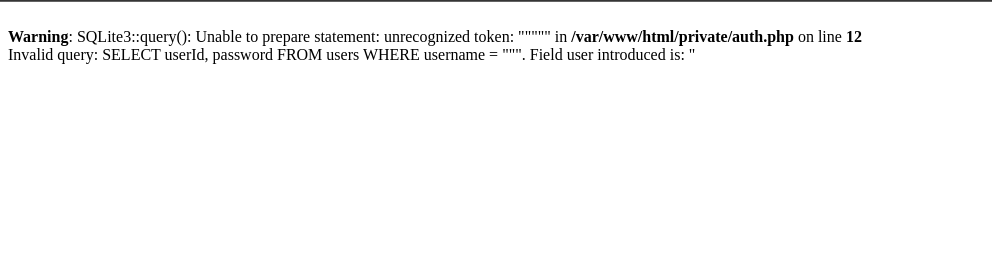

# Talent ScoutTech


# Índice

- [Talent ScoutTech](#talent-scouttech)
- [Índice](#índice)
  - [SQLi](#sqli)
  - [XSS](#xss)
  - [Control de acceso, autenticacion y sesiones de usuarios](#control-de-acceso-autenticacion-y-sesiones-de-usuarios)
  - [Servidores web](#servidores-web)
  - [CSRF](#csrf)

## SQLi

**A**

En el formulario de inicio de sesión, se puede realizar una inyección SQL en el campo de usuario, provocando un error con comillas dobles(“), se puede visualizar la consulta.


```sql
SELECT userId, password FROM users WHERE username \= """. Field user introduced is: "
```



**B**

En el formulario de inicio de sesion, he realizado una inyeccion SQL estavez con este formato en el campo de usuario ` OR PASSWORD="1234" \-- \-` y hemos usado la contraseña `1234`.


## XSS


## Control de acceso, autenticacion y sesiones de usuarios


## Servidores web


## CSRF


