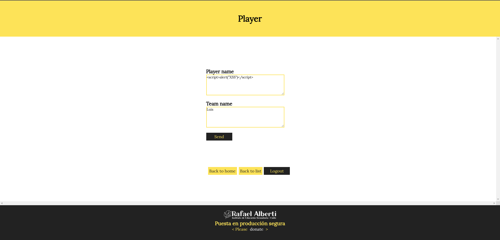
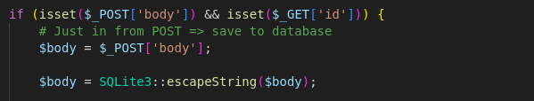

# Talent ScoutTech


# Índice

- [Talent ScoutTech](#talent-scouttech)
- [Índice](#índice)
  - [SQLi](#sqli)
  - [XSS](#xss)
  - [Control de acceso, autenticacion y sesiones de usuarios](#control-de-acceso-autenticacion-y-sesiones-de-usuarios)
  - [Servidores web](#servidores-web)
  - [CSRF](#csrf)

## SQLi

**A**

En el formulario de inicio de sesión, se puede realizar una inyección SQL en el campo de usuario, provocando un error con comillas dobles(“), se puede visualizar la consulta.


```sql
SELECT userId, password FROM users WHERE username \= """. Field user introduced is: "
```


**B**

En el formulario de inicio de sesion, he realizado una inyeccion SQL estavez con este formato en el campo de usuario ` OR PASSWORD="1234" -- -` y hemos usado la contraseña `1234`.


Con esto conseguimos loguearnos sin usar el nombre de usuario y sabiendo que la contraseña de uno de los usuarios es `1234`

**C**

Al acceder al código del archivo `auth.php`, se puede ver que en la función `areUserAndPasswordValid()` se utiliza `SQLite3::escapeString()`. Esta función no hace que el código sea seguro frente a inyecciones SQL, ya que solo escapa comillas simples y algunos caracteres especiales. Esto permite que un atacante pueda manipular la consulta SQL usando comillas dobles o caracteres especiales. Por lo tanto, es necesario modificar el código y utilizar consultas preparadas.

Se cambia el codigo original por algo parecido a esto:

```sql
$query \= $db-\>prepare('SELECT userId, password FROM users WHERE username \= :username'); 
$query-\>bindValue(':username', $user, SQLITE3\_TEXT); 
$result \= $stmt-\>execute();
```

**D**

La vulnerabilidad encontrada en `add\_comment.php~` es que es vulnerable a XSS.



Para solucionar esto, podemos formatear los datos antes de mostrarlos para evitar el XSS.

```sql
 $body = htmlspecialchars($_POST['body'], ENT_QUOTES, 'UTF-8');
```


## XSS

**A**

Comprobamos que la web es vulnerable a XSS accediendo al formulario de la pagina `add_comment.php` y añadiendo un comentario con forma de script, por ejemplo `<script\>alert('Comprobar XSS');\</script\>`.


**B**

`&amp;`  una entidad HTML que representa el carácter `&` de forma segura. Si no se escapa de manera correcta se puede aprovechar para inyectar HTML o JavaScript (XSS).

**C**

En  `show\_comments.php` vemos que al mostrar los comentarios, el código no escapa la salida antes de mostrar el HTML.



Podriamos solucionar esto de la siguiente manera:

```sql
echo htmlspecialchars($escapedBody, ENT_QUOTES, 'UTF-8');
```

**D**

Las otras paginas que son vulneradas por este mismo problema con el XSS son `buscador.html` y `insert\_player.php`.
Para descubrir esta misma vulnerabilidad, hemos inyectado script en los formularios de dichas paginas y efectivamente son vulnerables a XSS.
Me gustaria destacar que en `insert\_player.php` se puede cambiar el maxlenght ya que viene limitado a 30 caracteres.

Vulnerabilidad en `buscador.html`.


Vulnerabilidad en `insert\_player.php`.


## Control de acceso, autenticacion y sesiones de usuarios

**A**

Vamos a cambiar el codigo de `register.php` para evitar el acceso de usuarios que no existan, vamos a encriptar la contraseña y preparar las consultas para evitar inyecciones SQL.

```php
<?php
require_once dirname(__FILE__) . '/private/conf.php';


# Validación de los datos de entrada 
if (isset($_POST['username']) && isset($_POST['password'])) {
    $username = $_POST['username'];
    $password = $_POST['password'];

    // Validar username: solo letras y números
    if (!preg_match("/^[a-zA-Z0-9]*$/", $username)) {
        die("Invalid username format.");
    }

    // Validar password (mínimo 8 caracteres, al menos una letra y un número)
    if (!preg_match("/^(?=.*[A-Za-z])(?=.*\d)[A-Za-z\d]{8,}$/", $password)) {
        die("Password must be at least 8 characters long, and contain at least one letter and one number.");
    }

    // Verificar si el usuario ya existe
    $query = "SELECT * FROM users WHERE username = :username";
    $stmt = $db->prepare($query);
    $stmt->bindParam(':username', $username, SQLITE3_TEXT);
    $result = $stmt->execute();

    if ($result->fetchArray()) {
        die("Username already taken.");
    }

    // Encriptar la contraseña
    $hashed_password = password_hash($password, PASSWORD_DEFAULT);

    // Usar una sentencia preparada para la inserción segura
    $query = "INSERT INTO users (username, password) VALUES (:username, :password)";
    $stmt = $db->prepare($query);
    $stmt->bindParam(':username', $username, SQLITE3_TEXT);
    $stmt->bindParam(':password', $hashed_password, SQLITE3_TEXT);

    if ($stmt->execute()) {
        header("Location: list_players.php");
    } else {
        die("Failed to register user.");
    }
}

# Show form

?>
```


**B**

Implementamos medidas de seguridad clave en `auth.php`: usamos sesiones en lugar de cookies, consultas SQL preparadas para evitar inyecciones, y password_verify() para la validación segura de contraseñas. Además, almacenamos de forma segura los datos de autenticación en la sesión y gestionamos el cierre de sesión adecuadamente. 

```php
<?php
require_once dirname(__FILE__) . '/conf.php';

session_start(); // Iniciar sesión en lugar de usar cookies

$userId = FALSE;

# Comprobar si el usuario y la contraseña son válidos
function areUserAndPasswordValid($user, $password) {
    global $db, $userId;

    // Sentencia preparada para evitar SQL Injection
    $query = "SELECT userId, password FROM users WHERE username = :username";
    $stmt = $db->prepare($query);
    $stmt->bindParam(':username', $user, SQLITE3_TEXT);
    $result = $stmt->execute();
    $row = $result->fetchArray();

    if (!isset($row['password'])) return FALSE;

    // Verificar si la contraseña es válida
    if (password_verify($password, $row['password'])) {
        $userId = $row['userId'];
        $_SESSION['userId'] = $userId; // Almacenar en sesión
        $_SESSION['user'] = $user; // Guardar usuario en sesión
        return TRUE;
    } else {
        return FALSE;
    }
}

# Login
if (isset($_POST['username']) && isset($_POST['password'])) {
    $username = $_POST['username'];
    $password = $_POST['password'];

    if (areUserAndPasswordValid($username, $password)) {
        $login_ok = TRUE;
        $error = "";
    } else {
        $login_ok = FALSE;
        $error = "Invalid user or password.<br>";
    }
}

# Logout
if (isset($_POST['Logout'])) {
    // Cerrar sesión de manera segura
    session_unset(); // Eliminar todas las variables de sesión
    session_destroy(); // Destruir la sesión
    header("Location: index.php");
    exit;
}

# Si el usuario no está logueado, mostrar la página de login
if (!$login_ok) {
    header("Location: login.php");
    exit();
}
?>

```

**C**

En `register.php`, hemos asegurado el acceso al registro al redirigir a los usuarios no autenticados al login, aplicar control de acceso por roles y proteger el formulario con un token CSRF, limitando el registro solo a usuarios con permisos específicos.

**D**

Para corregir la vulnerabilidad, se debe usar una imagen predefinida, configurar el servidor web para restringir el acceso a la carpeta private mediante permisos adecuados, y almacenar configuraciones sensibles fuera del directorio raíz de la web, garantizando así la protección de datos y la seguridad del sistema.

**E**

Para mejorar la seguridad en la autenticación, se utiliza `$_SESSION` para gestionar el acceso del usuario, configurando las cookies de sesión con los atributos `HttpOnly`,  `Secure` y `SameSite` para protegerlas contra ataques como el XSS y CSRF. Además, se incluyen tokens de seguridad en los formularios para prevenir la falsificación de solicitudes.

## Servidores web

Para asegurar la sesión del usuario, debemos usar `HTTPS`, configurar HSTS en el servidor y regenerar la sesión al iniciar sesión. También es importante proteger las cookies con los atributos `HttpOnly` y `Secure`. Para prevenir inyecciones SQL, XSS y CSRF, implementamos consultas preparadas, escapamos entradas y usamos tokens CSRF. Además, podemos mejorar la gestión de cookies con expiración o límites para reforzar la seguridad.


## CSRF

**A**

Para añadir el boton bajo el nombre del equipo ponemos este codigo:

```html
<a href="http://web.pagos/donate.php?amount=100\&receiver=attacker" style="text-decoration: none;"> <button>Profile</button></a>
```


Y quedaria de la siguiente manera:


**B**

Para que ese codigo se ejecute sin que el usuario lo note he usado `` con el enlace en `show\_comments.php`.

```html

```


**C**

Para que funcionase necesitariamos tener un usuario autenticado en esa pagina y una sesión activa. 

**D**

Para ello tendriamos que poner un comentario mas extenso:

```html

```


